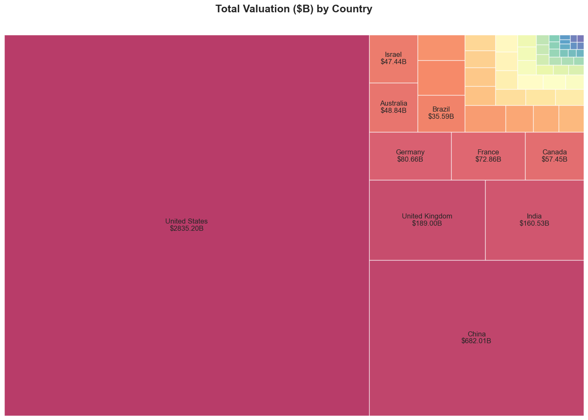
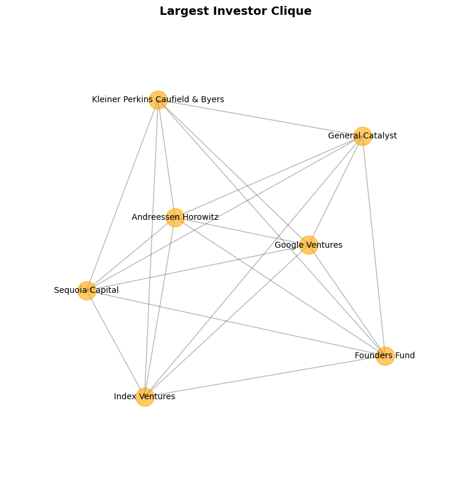

# 🦄 The Secret Lives of Unicorns

Every month, new startups gallop into the $1B+ unicorn club. As of July 2025, CB Insights counts over 1,200 unicorns worldwide. There are even rarer breeds: decacorns ($10B+) and hectocorns ($100B+). But where do these unicorns live? How have they grown? And most importantly, who feeds them?

This project dives into the [CB Insights unicorn dataset](https://www.cbinsights.com/research-unicorn-companies) to map the global unicorn ecosystem and decode the investor networks behind it.

Through exploratory data analysis and network science, we explore:
- Where unicorns live and how they’ve grown over time
- Which industries dominate the billion-dollar club
- Who the power investors are and how they form alliances

-----

## Chapter 1: Understanding the unicorn ecosystem

### Where do unicorn live?

The US is home to over half the global unicorn herd (56%), followed by China, India, the UK, and Germany.

When we look at total valuation, the leaderboard stays similar: the US dominates, China comes second, and the UK and India fight for third place.

### How have unicorns grown over time?

2021 was a historic explosion: nearly 500 new unicorns, almost 5× more than 2020.

Let's trace back where in the world the unicorns blew up.

Zooming in geographically, we see that the US saw a 6× jump in 2021 alone. Meanwhil, China started building its herd earlier, with a boom starting in 2015. Countries like France and South Korea saw more stop-and-go growth with years of zero new unicorns.

### Which industries dominate?

Early unicorns clustered in Consumer & Retail and Financial Services. But in 2018, Enterprise Tech broke through.

Industrials lag behind in unicorn count but punch above their weight in total valuation, outpacing even Financial Services.

### Where is the money?

The US takes up more than half of the total unicorn valuation.

In terms of industry, Enterprise Tech dominates both the total valuation and unicorn count. Industrials have fewer unicorns than Financial Services and Consumer & Retail, but has more valuation than the other two. Media & Entertainment has smaller number of unicorns but valuation-wise is catchings up Industrials and Financial Services.

-----

## Chapter 2: Decoding the investor network

### Building the co-investor network

I built an investor-investor co-investing network with each node representing an investor and each edge existing if the two investors invested in a same company. The network consists of 1357 nodes (investors) and 2973 edges (co-investments).

### Who are the power players?

Most active investors include Accel, Andreessen Horowitz, Sequoia Capital, Insight Partners and Tiger Global Management. Prominently, Accel is the most connected, having co-invested with 99 other investors.

### Communities and Cliques

Using the Louvain algorithm, I detected 4 investor communities. These represent clusters of investors who repeatedly back unicorns together, often signaling regional networks or strategic alliances.

The largest detected community consists of 155 investors and 356 co-invesetments. This cluster is the largest group of investors who frequently team up.

While largest community by Louvain algorithm shows a macro-perspective of the densely connected subgraph of the network, the largest investor clique gives more localized insight into clusters where nodes are fully connected.

The largest clique consists of 7 investors: Kleiner Perkins Caufield & Byers, Andreessen Horowitz, Sequoia Capital, Google Ventures, Founders Fund, General Catalyst and Index Ventures.

Investigation into the unicorns that these investors invested in: Sequoia Capital & Andreessen Horowitz and Sequoia Capital & Index Ventures are the two strongest co-investing pairs. Remote was co-invested by three different pairs, showing that it attracts multiple VCs and is a 'consensus bet'. Founders Fund co-invested together with multiple investors (ie. 6 investors) but only in 1 or 2 unicorns with each. It is more like a "bridge" between investors in the network.

### Co-investing recommender system

I looked into open triangles, which are formed by 3 nodes and 2 edges, showing the tendency or potential of making a close triangle. If the two investors are in an open triangle with a mutual co-investor, the system can suggest them to co-invest together.

Top suggestions include: Andreessen Horowitz × Insight Partners, Index Ventures × Tiger Global Management and General Catalyst × Y Combinator. These are the "future alliances" most likely to form based on shared networks.

